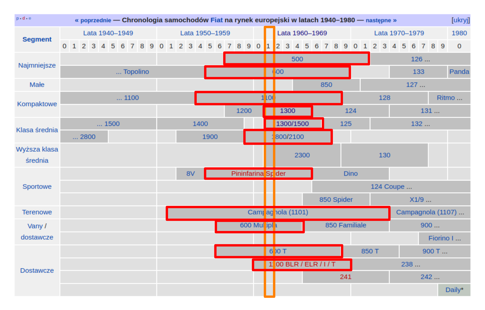
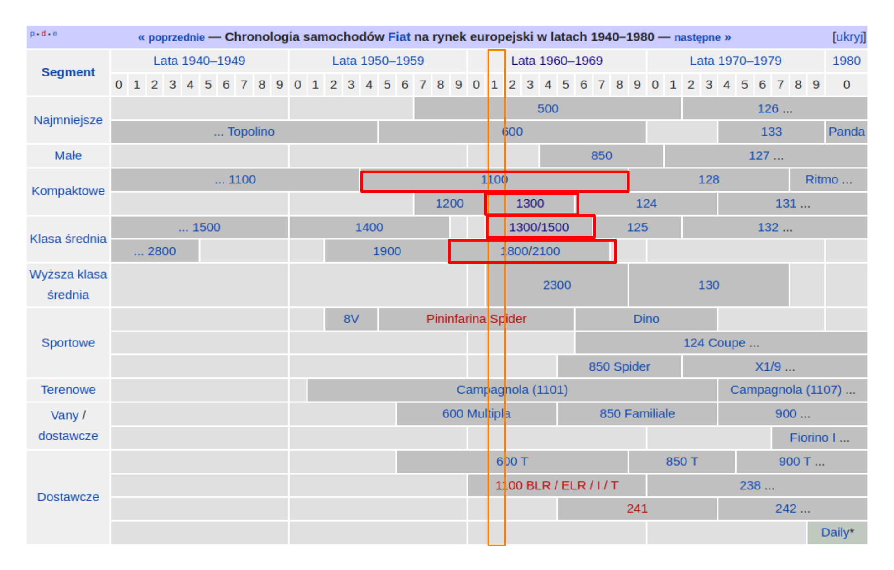
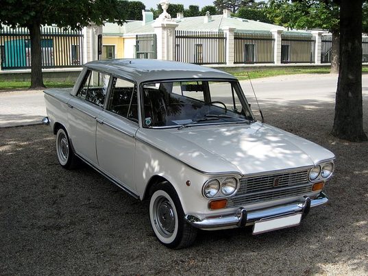

# Projekt z eksploracji danych

## Wstęp

Analiza dotyczy parametrów samochodów osobowych, wystawionych na sprzedaż za pośrednictwem portalu internetowego <a href="https://www.otomoto.pl/"> otomoto.pl</a> z okolic Lublina (w promieniu 50 km).

Informacje o samochodach zostały pobrane ze strony za pomocą osobnego skryptu napisanego w R (październik 2022):

[otomoto_scraping.R](./otomoto_scraping.R) ([Opis działania skryptu](./opis_dzialania_skryptu.html))

### Czego możemy się dowiedzieć?

Analiza parametrów samochodów osobowych może obejmować wiele różnych czynników zależnych od preferencji konkretnego klienta. Przykłady parametrów, które mogą być brane pod uwagę, to m.in. moc silnika, pojemność skokowa, rodzaj paliwa, wielkość i typ nadwozia, wyposażenie, przestronność wnętrza, bezpieczeństwo i wygodę. Parametry te mogą być również porównywane między różnymi modelami samochodów, aby uzyskać informacje na temat ich wydajności, jakości i kosztów eksploatacji. Analiza parametrów samochodów osobowych może być używana do określenia najlepszej oferty cenowej w stosunku do określonych wymagań klienta.

### Opis Parametrów

Zbiór danych zawiera następujące parametry:

-   **id -** wybrany przez nas indywidualny numer pojazdu

-   **Marka_pojazdu**

-   **Model_pojazdu**

-   **Rok_produkcji**

-   **Przebieg** - liczba przejechanych kilometrów

-   **Pojemność skokowa:**

    -   **Objętość (pojemność) skokową silnika** -- iloczyn objętości (pojemności) skokowej cylindra i liczby cylindrów:$$
        V=\frac{\pi}{4} \cdot d^{2} \cdot s \cdot n$$
        -   gdzie:

            -   $d$ - średnica cylindra

            -   $s$ - skok tłoka

            -   $n$ - liczba cylindów

-   **Rodzaj_paliwa:**

    Samochody osobowe mogą pracować na różnych rodzajach paliw. Najbardziej popularnyme dla samochodów osobowych to benzyna, diesel, gaz ziemny, napęd hybrydowy i energia elektryczna.

    -   **Benzyna** jest paliwem zawierającym zwykle około 85% węglowodorów i jest używana do napędzania większości samochodów osobowych. Jest to jedno z najtańszych paliw dostępnych na rynku, a do tego jest łatwo dostępne. Jednakże jest ona również bardzo szkodliwa dla środowiska, ponieważ wytwarza duże ilości dwutlenku węgla, tlenków azotu i innych zanieczyszczeń.

    -   **Diesel** to aktualnie najpopularniejszy rdzaj paliw stosowanych w samochodach osobowych. Paliwo to jest wysoce wydajne i ekonomiczne, dlatego zyskuje popularność wśród tych, którzy szukają oszczędności. W porównaniu z benzyną, diesel wytwarza więcej tlenków azotu i innych zanieczyszczeń, które są szkodliwe dla środowiska.

    -   **Gaz ziemny (LPG)** jest jednym z najbardziej ekonomicznych paliw stosowanych w samochodach osobowych. Wytwarzany z naturalnych i odnawialnych źródeł, takich jak metan i węgiel. Jego wytwarzanie wytwarza mniej dwutlenku węgla i innych zanieczyszczeń niż benzyna lub diesel.

    -   **Napęd hybrydowy** jest połączeniem benzyny i energii elektrycznej. Samochody hybrydowe wykorzystują silnik spalinowy do napędzania samochodu, ale również wykorzystują silnik elektryczny, aby wspierać pracę silnika spalinowego i zwiększyć wydajność.

    -   **Energia elektryczna** jest coraz popularniejszym paliwem w samochodach osobowych. Samochody elektryczne nie wytwarzają żadnych szkodliwych zanieczyszczeń, co czyni je znacznie przyjazniejszymi dla środowiska. Są zazwyczaj droższe od samochodów zpalinowych, a także mają mniejszy zasięg. Problematyczna może okazać się również wymiana i utylizacja zużytej baterii.

-   **Moc:**

    Parametr wyrażony w koniach mechanicznych (KM), oznaczający pracę, jaką jest w stanie wykonać silnik w określonym czasie. Im wyższa jest moc, tym krótszy będzie czas potrzebny do np. rozpędzenia auta. Maksimum wynika z momentu obrotowego oraz prędkości obrotowej silnika i również jest osiągana w określonych warunkach, przeważnie w górnej skali obrotów.

-   **Typ_nadwozia:**

    Typy nadwozia samochodów osobowych obejmują:

    1.  **Sedan**: Najbardziej popularny typ samochodu osobowego, charakteryzujący się czterema drzwiami i kontuarem.

    2.  **Kombi**: Samochód osobowy z drzwiami tylnymi i konturem. W porównaniu z nadwoziem typu sedan zwiększoną pojemność bagażnika. Jest to wygodny wybór dla osób, które często transportują duże ilości bagażu.

    3.  **Hatchback(auta miejskie)**: Zazwyczaj ma cztery drzwi, kontur i szerokie tylne siedzenia.

    4.  **Coupe**: składa się z dwóch lub trzech drzwi z zazwyczaj zmniejszoną liczbą siedzeń w porównaniu z tradycyjnym sedanem. Charakteryzuje się długim, płaskim dachem i zazwyczaj zwężonym tyłem. Coupe zazwyczaj występuje w wersji sportowej i oferuje wyższą wydajność i więcej mocy niż sedan.

    5.  **Kabriolet**: Samochód osobowy z dachem składanym. Jest to wybór idealny dla osób, które chcą cieszyć się jazdą na otwartym powietrzu.

    6.  **SUV**: Składa się z czterech drzwi, dwóch lub trzech rzędów siedzeń, a także zazwyczaj znacznie większego przestrzeni bagażowej niż w zwykłym sedanie. SUV-y często mają wyższy prześwit niż sedan, co pozwala im na wjazd w tereny trudniej dostępne. SUV-y są zazwyczaj bardziej wytrzymałe i mają większą moc niż zwykłe samochody osobowe.

    7.  **Minivan**: Samochód osobowy z dużą przestrzenią w kabinie, który jest idealny dla rodzin z dziećmi.

    8.  **Kompakt**: Mały samochód osobowy z dużym bagażnikiem, który jest wyposażony w cztery drzwi i kontur. Jest to idealny wybór dla osób, które szukają oszczędności paliwa i mniejszych rozmiarów.

    9.  **Auta małe**: Bardzo mały samochód osobowy, który jest wyposażony w dwie lub cztery drzwi i kontur. Jest to wybór idealny dla osób, które szukają oszczędności paliwa i mniejszych rozmiarów.

-   **Kolor**

    Kolor samochodu może być jednym z ważniejszych wyznaczników jego wyglądu. Odcień lakieru może wpływać na to, jak samochód jest postrzegany przez innych. Niektórzy uważają, że kolor samochodu może nawet wpływać na to, jak czują się za jego kierownicą.

    Kolory samochodów są często związane z określonymi osobowościami. Na przykład, czerwony jest postrzegany jako kolor ekscytujący i dynamiczny, a czarny jest postrzegany jako kolor luksusowy i elegancki.

-   **Cena**

## 1. Czyszczenie Danych

### Wczytanie danych

```{r}
library(rio)
library(tidyverse)
library(knitr)
library(ggcorrplot)

autka <- import(file="otomoto.csv")

head(autka)|>
  kable()
```

### Poszukiwanie brakujących danych

Jeżeli w procesie pobierania danych ze strony, jakiś parametr nie został wczytany, wtedy w jego miejsce zostaje zapisana wartość następnego parametru. Oznacza to, że w przypadku pojawienia się braków, ostatnia kolumna (Cena) będzie przyjmować wartość “NA”.

```{r}
autka[is.na(autka$Cena)==T,] |>
  kable()
```

Braki pojawiają się dla samochodów o indeksach: 585, 1000, oraz 1001. Uwagę przykuwa fakt, że są to wyłącznie samochody elektryczne. Sprawdzmy więc dodatkowo, czy to wszystkie samochody elektryczne z bazy.

```{r}
elektryczne <- NULL
for(i in 1:dim(autka)[1]){
  for(j in 1:dim(autka)[2]){
    if(is.na(autka[i,j])==F) {
      if(autka[i,j]=="Elektryczny") {
        elektryczne <- append(elektryczne,i)
      }
    }
  }
}
autka[elektryczne,] |>
  kable()
```

Zgadza się. Tylko samochody elektryczne generują problemy z wczytywaniem danych, ponieważ nie posiadają takiego parametru jak Pojemość skokowa (przypiszmy im więc wartość 0). Dodatkowo, dla samochodów o indeksach 1000 oraz 1001 nie został wczytany parametr przebieg, może to być spowodowane tym, że są to nowe samochody, które nie przejechały jeszcze żadnej trasy. W tym przypadku również przypisujemy 0. Rodzaj paliwa uzupełniamy jako Elektryczny, a pozostałe wartości parametrów umieszczamy we właściwych kolumnach.

```{r}
autka[elektryczne[1],7:11] <- autka[elektryczne[1],6:10]

autka[elektryczne[2:3],7:11] <- autka[elektryczne[2:3],5:9]
autka[elektryczne[2:3],5] <- 0
autka[elektryczne[1:3],6] <- 0

autka[elektryczne,] |>
  kable()

```

### Typy danych

Tworzymy ramkę danych z poprawionej bazy danych:

```{r}
    autka_dt <- data.frame(autka)
    
```

```{r}
colSums(is.na(autka_dt))
```

### Duplikaty

Pozbądźmy się na wstępie ewentualnych duplikatów

```{r}
autka_dt <- autka_dt[!duplicated(autka_dt),]
```

```{r}
summary(autka_dt)
```

Parametry: Marka_pojazdu, Model pojazdu, Rodzaj, Paliwa, Typ_nadwozia oraz Kolor ustawiamy na typ kategoryczny (factor).

```{r}
autka_dt$Marka_pojazdu <- as.factor(autka$Marka_pojazdu)
autka_dt$Model_pojazdu <- as.factor(autka$Model_pojazdu)
autka_dt$Kolor <- as.factor(autka$Kolor)
autka_dt$Typ_nadwozia <- as.factor(autka$Typ_nadwozia)
autka_dt$Rodzaj_paliwa <- as.factor(autka$Rodzaj_paliwa)
```

Parametry takie jak: Przebieg,Pojemnosc,skokowa,Moc oraz Cena ustawiamy jako typ ilościowy (numeric).

```{r}
autka_dt$Przebieg <- parse_number(gsub(" ","",autka_dt$Przebieg))
autka_dt$Pojemność_skokowa<- parse_number(gsub(" ","",autka_dt$Pojemność_skokowa))
autka_dt$Moc <- parse_number(gsub(" ","",autka_dt$Moc))
autka_dt$Cena <- parse_number(gsub(" ","",autka_dt$Cena))

 summary(autka_dt)
```

## 2. Integracja Danych

### Podstawowe statystyki opisowe

Przyjżyjmy się teraz podstawowym statystykom opisowym poszczególnych zmiennych.

### Zmienne kotegoryczne

#### Marka pojazdu

```{r}
autka_Marki <- autka_dt|>
  count(Marka_pojazdu) |>
  data.frame()
colnames(autka_Marki)[2] <- "Liczba_aut"

#posortowane malejąco względem liczby aut
autka_Marki_sort <- autka_Marki[order(autka_Marki$Liczba_aut, decreasing=T), ]

# % 
autka_Marki_sort_procent <- round((autka_Marki_sort$Liczba_aut*100)/dim(autka_dt)[1],2)

cbind(autka_Marki_sort,autka_Marki_sort_procent)|>
  kable(caption = "Liczba aut poszczególnych marek samochodów (malejąco)",
        col.names = c("Marka","liczba aut","% "))
```

```{r}
library(plotly)
obiekt <- ggplot(autka_Marki, aes(x=Liczba_aut,y=Marka_pojazdu, fill=Marka_pojazdu)) +
geom_bar(stat="identity")
  ggplotly(obiekt)
```

Najpopularniejszymi markami samochodów wystawianymi na sprzedarz w okolicach Lublina to:

BMW 8.65%

Audi 7.69%

Volvo 6.81

#### Model pojazdu

Analizować będziemy tylko 5 najpopularniejszych marek ( z powyższego zestawienia ). Będą to:

##### **BMW**

```{r}
  top10 <- head(autka_Marki_sort[,1],n=10)
autka_Model <- autka_dt[autka_dt$Marka_pojazdu==top10[1],]|>
  count(Model_pojazdu) |>
  data.frame()
colnames(autka_Model)[2] <- "Liczba_aut"

autka_Model_sort <- autka_Model[order(autka_Model$Liczba_aut, decreasing=T), ]

autka_Model_sort_procent <- round((autka_Model_sort$Liczba_aut*100)/sum(autka_Model$Liczba_aut),2)

cbind(autka_Model_sort,autka_Model_sort_procent)|>
  kable(caption = paste("Liczba aut poszczególnych modeli marki",top10[1],"(malejąco)",sep=" "),
        col.names = c("Model","liczba aut","% "))  
```

```{r}
obiekt <- ggplot(autka_Model, aes(x =Liczba_aut,y=Model_pojazdu, fill=Model_pojazdu)) +
geom_bar(stat="identity")
  ggplotly(obiekt)
```

##### **Audi**

```{r}
autka_Model2 <- autka_dt[autka_dt$Marka_pojazdu==top10[2],]|>
  count(Model_pojazdu) |>
  data.frame()
colnames(autka_Model2)[2] <- "Liczba_aut"

autka_Model_sort2 <- autka_Model2[order(autka_Model2$Liczba_aut, decreasing=T), ]

autka_Model_sort_procent2 <- round((autka_Model_sort2$Liczba_aut*100)/sum(autka_Model2$Liczba_aut),2)

cbind(autka_Model_sort2,autka_Model_sort_procent2)|>
  kable(caption = paste("Liczba aut poszczególnych modeli marki",top10[2],"(malejąco)",sep=" "),
        col.names = c("Model","liczba aut","% "))  
```

```{r}
obiekt <- ggplot(autka_Model2, aes(x =Liczba_aut,y=Model_pojazdu, fill=Model_pojazdu)) +
geom_bar(stat="identity")
  ggplotly(obiekt)
```

##### **Volvo**

```{r}
autka_Model3 <- autka_dt[autka_dt$Marka_pojazdu==top10[3],]|>
  count(Model_pojazdu) |>
  data.frame()
colnames(autka_Model3)[2] <- "Liczba_aut"

autka_Model_sort <- autka_Model3[order(autka_Model3$Liczba_aut, decreasing=T), ]

autka_Model_sort_procent <- round((autka_Model_sort$Liczba_aut*100)/sum(autka_Model3$Liczba_aut),2)

cbind(autka_Model_sort,autka_Model_sort_procent)|>
  kable(caption = paste("Liczba aut poszczególnych modeli marki",top10[3],"(malejąco)",sep=" "),
        col.names = c("Model","liczba aut","% "))  
```

```{r}
obiekt <- ggplot(autka_Model3, aes(x =Liczba_aut,y=Model_pojazdu, fill=Model_pojazdu)) +
geom_bar(stat="identity")
  obiekt|>ggplotly()
```

##### **Volkswagen**

```{r}
autka_Model4 <- autka_dt[autka_dt$Marka_pojazdu==top10[4],]|>
  count(Model_pojazdu) |>
  data.frame()
colnames(autka_Model4)[2] <- "Liczba_aut"

autka_Model_sort <- autka_Model4[order(autka_Model4$Liczba_aut, decreasing=T), ]

autka_Model_sort_procent <- round((autka_Model_sort$Liczba_aut*100)/sum(autka_Model4$Liczba_aut),2)

cbind(autka_Model_sort,autka_Model_sort_procent)|>
  kable(caption = paste("Liczba aut poszczególnych modeli marki",top10[4],"(malejąco)",sep=" "),
        col.names = c("Model","liczba aut","% "))  
```

```{r}
obiekt <- ggplot(autka_Model4, aes(x =Liczba_aut,y=Model_pojazdu, fill=Model_pojazdu)) +
geom_bar(stat="identity")
  obiekt|>ggplotly()
```

##### **Opel**

```{r}
autka_Model5 <- autka_dt[autka_dt$Marka_pojazdu==top10[5],]|>
  count(Model_pojazdu) |>
  data.frame()
colnames(autka_Model5)[2] <- "Liczba_aut"

autka_Model_sort <- autka_Model5[order(autka_Model5$Liczba_aut, decreasing=T), ]

autka_Model_sort_procent <- round((autka_Model_sort$Liczba_aut*100)/sum(autka_Model5$Liczba_aut),2)

cbind(autka_Model_sort,autka_Model_sort_procent)|>
  kable(caption = paste("Liczba aut poszczególnych modeli marki",top10[5],"(malejąco)",sep=" "),
        col.names = c("Model","liczba aut","% "))  
```

```{r}
obiekt <- ggplot(autka_Model5, aes(x =Liczba_aut,y=Model_pojazdu, fill=Model_pojazdu)) +
geom_bar(stat="identity")
  obiekt|>ggplotly()
```

#### Typ nadwozia

```{r}
autka_nadwozie <- autka|>
  count(Typ_nadwozia) |>
  data.frame()
colnames(autka_nadwozie)[2] <- "Liczba_aut"

autka_nadwozie_sort <- autka_nadwozie[order(autka_nadwozie$Liczba_aut, decreasing=T), ]

autka_nadwozie_sort_procent <- round((autka_nadwozie_sort$Liczba_aut*100)/sum(autka_nadwozie$Liczba_aut),2)

cbind(autka_nadwozie_sort,autka_nadwozie_sort_procent)|>
  kable(caption = paste("Typ nadwozia","(malejąco)",sep=" "),
        col.names = c("Typ nadwozia","liczba aut","% "))
```

```{r}
obiekt <-ggplot(autka_nadwozie,aes(x=Liczba_aut,y=Typ_nadwozia,fill=Typ_nadwozia)) +
geom_bar(stat="identity")
  obiekt|>ggplotly()
```

Najpopularniejszym typem nadwozia okazał się **SUV.**

Ludzie jeżdżą samochodami typu SUV, ponieważ są one bardziej wytrzymałe i mają lepszą przyczepność w trudnych warunkach. SUV-y mają również większą przestrzeń wewnątrz, co oznacza, że są one bardziej funkcjonalne dla rodzin i osób, które potrzebują dużej ilości miejsca do przewożenia przedmiotów. Są również bardziej wygodne i bezpieczne, ponieważ mają wyższe siedzenia i wyższy próg, co zapewnia lepszą widoczność i stabilność.

#### Rodzaj Paliwa

```{r}
autka_paliwo <- autka|>
  count(Rodzaj_paliwa) |>
  data.frame()
colnames(autka_paliwo)[2] <- "Liczba_aut"

autka_paliwo_sort <- autka_paliwo[order(autka_paliwo$Liczba_aut, decreasing=T), ]

autka_paliwo_sort_procent <- round((autka_paliwo_sort$Liczba_aut*100)/sum(autka_paliwo$Liczba_aut),2)

cbind(autka_paliwo_sort,autka_paliwo_sort_procent)|>
  kable(caption = paste("Rodzaj paliwa","(malejąco)",sep=" "),
        col.names = c("Rodzaj paliwa","liczba aut","% "))
```

```{r}
obiekt <-ggplot(autka_paliwo,aes(y=Liczba_aut,x=Rodzaj_paliwa,fill=Rodzaj_paliwa)) +
geom_bar(stat="identity")
  obiekt|>ggplotly()
```

Widzimy, że zdecydowaną większością są samochody napędzane benzyną. Ma ona wiele zalet, w tym wyższą sprawność niż inne paliwa, a także łatwość użytkowania. Niestety, benzyna ma też swoje wady, w tym wyższe emisje spalin i krótszy czas pracy niż inne paliwa. Związane jest to z procesem spalania benzyny, który jest nieco skomplikowany i wymaga większej ilości energii, niż pozostałe paliwa.

Silniki napędzane ropą mają zazwyczaj większą moc niż te napędzane innymi paliwami. Oznacza to, że są one lepsze do jazdy po autostradzie i pozwalają uzyskać wyższą prędkość maksymalną. Dodatkowo są bardziej ekonomiczne w zużyciu paliwa, dzięki czemu użytkownicy mogą zaoszczędzić na kosztach paliwa. Ogromną zaletą jest również długa żywotność silnika, co może wpływać na ich popularność.

Gaz ziemny jest znacznie bardziej ekologiczny niż benzyna lub olej napędowy, ale jest również trudniejszy w instalacji. Od użytkownika wymaga się aby przechowywać go w bezpieczny sposób. Ponadto samochody napędzane gazem ziemnym są droższe w produkcji niż samochody napędzane tradycyjnymi paliwami, co sprawia, że producenci samochodów niechętnie sięgają po te technologie. Wadą może okazać się również przymus częstego tankowania.

Hybrydy są relatywnie nowymi pojazdami na drogach, a ich popularność stale rośnie. Jednak jest to nadal rynek raczkujący, a producenci nadal udoskonalają technologię, aby zapewnić kierowcom najlepsze wrażenia z jazdy. Hybrydy są wyraźnie droższe niż tradycyjne samochody spalinowe, dlatego wielu kierowców może się wahać przy ich zakupie. Wraz z pojawieniem się nowszych technologii hybrydowe, które są coraz bardziej wydajne i wygodne, oczekuje się, że ich popularność będzie dalej rosnąć.\
Dlaczego jest ich tak mało?

-   Wysoka cena. Hybrydy są zazwyczaj droższe od tradycyjnych samochodów spalinowych.

-   Trudność w utrzymaniu. Zazwyczaj są również trudniejsze w utrzymaniu niż tradycyjne samochody spalinowe, ponieważ wymagają specjalnych części i narzędzi do serwisowania.

-   Ograniczony zasięg. Hybrydy zazwyczaj mają ograniczony zasięg, ponieważ akumulatory szybko się wyczerpują.

Najmniej jest samochodów elektrycznych (3 modele w całym zbiorze). Samochody elektryczne są wciąż na wczesnym etapie rozwoju i ich popularność jest ograniczona. Głównymi przyczynamisą niska dostępność, wysokie koszty zakupu, ograniczone możliwości ładowania, krótki zasięg i brak infrastruktury ładowania. W wielu krajach nie ma dostatecznego poziomu inwestycji w infrastrukturę do ładowania, a samochody elektryczne są obciążone wysokimi podatkami. Wciąż brakuje odpowiednich środków pomocy publicznej na zakup samochodów elektrycznych, co ogranicza dostępność tych pojazdów. Dodatkową przyczyną małej ilości samochodów, jest to, że nasza baza składa się w większości z samochodów będących eksploatowacnych przez przynajmniej jednego właściciela.

#### Kolor

```{r}
autka_kolor <- autka|>
  count(Kolor) |>
  data.frame()
colnames(autka_kolor)[2] <- "Liczba_aut"

autka_kolor_sort <- autka_kolor[order(autka_kolor$Liczba_aut, decreasing=T), ]

autka_kolor_sort_procent <- round((autka_kolor_sort$Liczba_aut*100)/sum(autka_kolor$Liczba_aut),2)

cbind(autka_kolor_sort,autka_kolor_sort_procent)|>
  kable(caption = paste("Kolory samochodów","(malejąco)",sep=" "),
        col.names = c("Kolor","liczba aut","% "))
```

```{r}
obiekt <-ggplot(autka_kolor,aes(x=Liczba_aut,y=Kolor,fill=Kolor)) +
geom_bar(stat="identity", fill=c("beige", "white","darkred",
                                  "brown","lightblue","black",
                                  "red","purple","darkblue",
                                  "#00A693","blue", "orange",
                                  "aliceblue","grey","green",
                                  "gold","yellow"),
                                  colour="black")
obiekt|>ggplotly()
```

Kolor samuchodu wybierany przez kupującego jest wyborem subiektywnym. Jednakże pojawiają się pewne przesłanki sługerujące, dlaczego pewne kolory są wybierane częściej od pozostałych:

Czarny kolor samochodu osobowego jest zazwyczaj wybierany ze względu na jego wszechstronność i uniwersalność. Jest on jednym z najbardziej popularnych kolorów samochodów osobowych, ponieważ łatwo dopasowuje się do innych kolorów, wygląda elegancko i jest łatwy w czyszczeniu. Ponadto uważany jest za symbol luksusu i statusu.

Popularność koloru szarego związana jest z uniwersalnością. Nie jest ani zbyt jasny ani zbyt ciemny, dzięki czemu pasuje do wielu stylów wystroju wnętrz. Jest również znacznie łatwiejszy do utrzymania w czystości niż inne jasne kolory. Dodatkowo, może on pomóc w zmniejszeniu temperatury wewnątrz kabiny, dzięki czemu pojazd jest bardziej komfortowy.

Srebrny podobnie jak kolor szary jest popularny ze względu na uniwersalność. Jest również łatwy w utrzymaniu, ponieważ nie ma potrzeby częstego polerowania i zabezpieczania.

Samochody w kolorze białym są łatwiejsze w utrzymaniu w czystości. Ponadto, biały kolor samochodu może pomóc w nadawaniu mu nowoczesnego wyglądu, który może zwiększyć jego wartość. Biały odcień jest również popularny ze względu na jego uniwersalny wygląd, który może pasować do każdego rodzaju otoczenia.

Zastanówmy się jeszcze, dlaczego kolory takie jak pomarańczowy czy filetowy są tak mało popularne? Oto kilka sugestii.

Fioletowe samochody są zazwyczaj wytwarzane z tańszych materiałów, co prowadzi do niższej jakości. Są również bardziej podatne na awarie i korozję, co oznacza większe koszty utrzymania. Ponadto, w porównaniu do nowych samochodów, mają mniej opcji i technologii, które są dostępne w nowych samochodach, przez co są mało atrakcyjne dla kupujących.

Pomarańczowy kolor samochodu jest zwykle uważany za zbyt odważny, zazwyczaj ludzie wolą kupować bardziej tradycyjne kolory, takie jak srebrny, czarny lub biały. Pomarańczowy samochód może wiązać się z trudnościami w utrzymaniu estetycznej czystości, ponieważ łatwo się brudzi i trudniej go wyczyścić.

2.  Zmienne ilościowe

```{r}
autka_liczbowe <- autka_dt[,c(4,5,6,8,11)]

liczbowe <- apply(autka_liczbowe,2,summary)
liczbowe <- rbind(liczbowe,St.dev=apply(autka_liczbowe,2,sd))

rownames(liczbowe) <- c('minimum','kwantyl dolny','mediana','średnia','kwantyl górny','maksimum','odchylenie standardowe')
as.data.frame(liczbowe) |>
  kable(caption="Statystyki parametrów typu liczbowego",
        digits = 0)
```

### Zmienne typu liczbowego

#### **Rok produkcji**

```{r}
as.data.frame(liczbowe[,1]) |>
  kable(caption="Rok produkcji",
        digits = 0,
        col.names = "Rok produkcji")
```

```{r}
hist (autka_liczbowe[,1],
      col=c("red", "green"),
      xlab="Rok produkcji",
      ylab="Częstotliwość",
      las =2,
      main="Histogram Roku Produkcji aut")
```

```{r}
boxplot(autka_dt$Rok_produkcji)
```

Widzimy, że 50% samochodów zostało wyprodukowanych w latach 2007-2016. Warością środkową są samochody z 2012 roku.

```{r}
autka[autka$Rok_produkcji==1961,] |>
  kable()
```

Najstarszym samochodem okazał się nr. 1171. Samochód został wyprodukowany 61 lat temu! Na podstawie histogramu wiemy, że naprawdę jest to rzadkie zjawisko. Wiemy, że samochod jest marki “FIAT”, niestety sprzedający nie podał konkretnego modelu auta. Wiemy jedynie, że jest marki FIAT. Po przeszukaniu informacji w internecie (link), udało się znaleźć informacje, że firma Fiat w 1961 roku produkowała tylko i wyłącznie poniższe samochody:  Dodatkowo wiemy, że typ nadwozia to sedan, a więc zwężamy zbiór możliwości do:  Analizując poszczególne modele, okazuje się że moc silnika naszego auta w porównaniu ze specyfikacjami modeli 1100 oraz 1300 jest za duża, natomiast model 1800/2100 według danych ze strony powinien mieć większą pojemność skokową silnika. Tak więc prawdopodobnie samochód z naszej bazy to właśnie Fiat 1500. Dane z bazy pokrywają się z podaną specyfikacją pojazdu. 

##### (***ciekawostka*** - samochody zabytkowe)

Aby auto zostało uznane za zabytek, musi spełnić kilka wytycznych, tj.:

-   ma przynajmniej 30 lat,

-   jest modelem wycofanym z produkcji przynajmniej 15 lat temu,

-   jest zbudowane przynajmniej w 75 proc. z oryginalnych części (jeżeli nie spełnia tego warunku, zostanie uznany za replikę oryginalnego modelu).

Wprawdzie zdarza się, że konserwator może wpisać do rejestru samochód, który nie ma 30 lat, ale tylko pod pewnymi warunkami. Jest to możliwe, jeżeli jest to nietypowa konstrukcja. To samo dotyczy szczególnego pochodzenia zastosowanych technologii i rozwiązań. Dlatego, jeżeli masz wyjątkowy pojazd, zwłaszcza należący w przeszłości do ważnej osobowości lub kogoś, kto osiągnął sukces sportowy itp., również możesz zarejestrować go jako samochód zabytkowy.

Sprawdźmy więc, ile samochodów z bazy spełnia pierwszy warunek (produkcja przed 1992 rokiem):

```{r}
dim(autka[autka$Rok_produkcji[]<=1992,])
autka[autka$Rok_produkcji[]<=1992,] |>
  kable( row.names = NA)
```

10 samochodów z bazy spełnia pierwszy warunek, aby mogły być uznane za auta zabytkowe.

Średni rok produkcji oraz mediana mają podobne wartości (2011/2012), oznacza to, że średnio oraz najcześciej sprzedawane są 10 letnie samochody.

Kwantyl dolny (2007) oraz górny (2016) infurmują, że 25% wszystkich samochodów została wyprodukowana przed 2007 rokiem, oraz 25% zostało wyprodokowanych po 2016 roku.

Dziwić może maksimum badanego parametru wynoszące 2023. (Dane pochodzą z października 2022)

```{r}
autka[autka$Rok_produkcji[]==2023,] |>
  kable()
```

Dostrzegamy również, że samochód ma już przejechane 9 kilometrów. (czyżby był z przyszłości !? ). Całe to zamieszanie jest spowodowane tym, że salony samochodowe nie przypisują samochodom im dokładnej daty produkcji, a tak naprawdę **datę modelową**, stąd na koniec każdego roku w salonach dostępna jest opcja kupna samochodu, którego rocznik jest z roku następnego. Jeżeli kupującego interesuje od kiedy samochód jest w użytku, najdokłądniejszą informacje uzyska dzięki wyczytaniu z dowodu rejestracyjnego **datę pierwszej rejestracji**.

Porównanie roku produkcji poszczególnych marek

```{r}
autka_dt|>
  group_by(Marka_pojazdu) |>
  summarise(minimim=min(Rok_produkcji),
            średnia=mean(Rok_produkcji),
            mediana=median(Rok_produkcji),
            maksimum=max(Rok_produkcji)) |>
  kable(caption = "Statystyki roku produkcji dla poszczególnych marek ")
```

#### **Przebieg**

```{r}
as.data.frame(liczbowe[,2]) |>
  kable(caption="Przebieg",
        col.names = "Przebieg")

hist (autka_liczbowe[,2],
      col=c("red", "green"),
      xlab="Przebieg",
      ylab="Częstotliwość",
      las =2,
      main="Histogram Przebiegu",
      breaks = 20)

boxplot(autka_liczbowe[,2])
```

Na samym początku uwagę przykuwa znacząco odbiegające od wszystkich obserwacji maksimum

```{r}
autka[autka$Przebieg=="2 230 000 km",] |>
  kable()
(2230000/14)/365
```

14 letni samochód prejechał 2 230 000 km. Oznacza to, że średnio jeździł po 93 tys. km w ciągu roku oraz `r (2230000/14)/365` km na dzień. Jako ciekawostka można dodać, że aby okrążyć ziemię wazdłuż równika, trzeba przejechać około 40 075 km. Nasz samochód mógłby okrążyć ziemię około `r round(2230000/40075,0)` razy. Jako kolejna ciekawostka dla zwizualizowania jak wielka jest to odległość dodajmy, że odległość z Ziemi na Księżyc wynisi 384 400 km.

Wydaje się to dosyć nierealne i prawdopodobnie sprzedający omyłkowo wpisał o jedno "0" za dużo przy wystawianiu ogłoszenia.

Sprawdzmy srednia samochodów z 2008 roku bez naszej wartości odstającej:

```{r}
przebieg <- autka_liczbowe[,2]
przebieg <- przebieg[-430]
przebieg[430]
median(przebieg)
mean(przebieg)
max(przebieg)
```

Widzimy, że średnia oraz mediana wynoszą około 173 tys. Przyjmijmy więc opcję, że sprzedający się pomylił i podał dzeisięciokrotność przebiegu auta.

Na wykresie ramka wąsy widzimy jeszcze jedną obserwacje odstającą. Przyjżyjmy się jej dokładniej:

```{r}
autka[autka$Przebieg=="1 230 000 km",] |>
  kable()
```

W tym przypadku widzimy jednak, że jest to auto 41 letnie, więc średnio jeździło 30 tys km rocznie. Wydaje się to prawdopodobne, dlatego zostawiamy tak jak jest. Zmieniamy tylko i wyłącznie samochód o identyfikatorze 430.

```{r}
#przebieg to kolumna 5
autka_dt[430,5] <- 223000
  autka_liczbowe <- autka_dt[,c(4,5,6,8,11)]
  liczbowe <- apply(autka_liczbowe,2,summary)
  liczbowe <- rbind(liczbowe,St.dev=apply(autka_liczbowe,2,sd))
  rownames(liczbowe) <- c('minimum','kwantyl dolny','mediana','średnia','kwantyl górny','maksimum','odchylenie standardowe')

```

Wyświetlmy więc statystyki ponownie dla zmionionej obserwacji 430.

```{r}
as.data.frame(liczbowe[,2]) |>
  kable(caption="Przebieg",
        col.names = "Przebieg")

hist (autka_liczbowe[,2],
      col=c("red", "green"),
      xlab="Przebieg",
      ylab="Częstotliwość",
      las =2,
      main="Histogram Przebiegu")
boxplot(autka_dt$Przebieg)
```

Wartośćią środkową jest 176 tys. przejechanych km. Średnio samochody wystawione na sprzedarz przejechały 171 tys kilometrów. 25% samochodów ma przebieg mniejszy niż 102 tys. kilometrów oraz 25% samochodów ma przebieg większy niż 237 tys. kilometrów.

Spróbujmy teraz oszacować, jaki przebieg powinien mieć samochód, zależnie od "wieku".

```{r}
autka_dt|>
  group_by(Rok_produkcji) |>
  summarise(minimim=min(Przebieg),
            średnia=mean(Przebieg),
            mediana=median(Przebieg),
            maksimum=max(Przebieg)) |>
  kable(caption = "Statystyki przebiegu zależne od roku produckji")
```

Aby było to praktyczne, dodajmy warunek, że szukamy aut do użytku, ale nienowego, czyli bierzmy pod uwagę auta z roczników 2002-2020 (młodsze niż 20 lat ale starsze niż dwuletnie).

```{r}
#auta z roczników 2002-2020
autka_dt2 <- autka_dt[autka_dt$Rok_produkcji<=2020 &autka_dt$Rok_produkcji>=2002,]
autka_dt2[,"Rok_produkcji"] <- 2022-autka_dt2[,"Rok_produkcji"]
colnames(autka_dt2)[4] <- "Wiek"

autka_dt2|>
  group_by(Wiek) |>
  summarise(średnia=mean(Przebieg),
            mediana=median(Przebieg),
            odchylenie_standardowe=sd(Przebieg))|>
  kable(caption = "Statystyki przebiegu zależne od wieku samochodu",
        digits = 0,
        align="c")
```

Przy pomocy tego oszacowania kupujący auto może zorientować się, jaki przebieg powienien mieć samochód w zależności od wieku. Zdarzają się niestety niegodziwcy, którzy "cofają" wskaźnik licznika aby sztucznie zwiększyć wartość auta. Dzięki powyższemu zestawieniu kupującemu łatwiej jest wykryć oszustwo.

Zbudujmy dodatkowo model liniowy zależności przebieku od wieku auta:

```{r}
library(stats)
hist(autka_dt2$Przebieg)

md_przebieg <- lm(Przebieg~Wiek,autka_dt2)
summary(md_przebieg)

```

```{r}
library(lmtest)
plot(md_przebieg)
  lmtest::raintest(md_przebieg)
  cor.test(autka_dt2$Przebieg,autka_dt2$Wiek)
```

```{r}
ggplot(aes(y=Przebieg,x=Wiek),data=autka_dt2)+
  geom_point()+
  geom_smooth(method = "lm")
```

*Wniosek: Na podstawie modelu możęmy wnioskować, że w ciągu jednego roku samochód przejeżdża średnio 11 tys. km +/- 400km. Jednakże powyższe zestawienie oraz wykres dopasowania wskazują, że błąd jest zaniżony. Duża zmienność przebiegu uniemożliwia nam dokładniejsze oszacowania.*

*Dodatkowo patrząc na wartości odchyleń standardowych z tabeli dla poszczególnego wieku wyciągamy kolejne wnioski:*

*Odchylenie standardowe młodszych aut ( wiek:1-6 )waha się na poziomie 4000.*

*Ciekawa zależność pojawia się dla starszych samochodów. Występuje tu pewien "przeskok" i wartość oschylenia standardowego starszych roczników zaczyna oscylować wokół 6000.*

**Oczywiście jest to tylko wskazówka, a nie dowód.**

Na postawie analizy przebiegu kupujący ma przesłanki do tego, aby zapyać sprzedającego o szczegóły auta, które mogą wpływać na przebieg. np. cel użytku samochodu przez byłego właściciela.

#### **Pojemność skokowa silnika**

```{r}
as.data.frame(liczbowe[,3]) |>
  kable(caption="Pojemność skokowa",
        digits = 0,
        col.names = "Pojemność skokowa")

hist (autka_liczbowe[,3],
      col=c("red", "green"),
      xlab="moc",
      ylab="Częstotliwość",
      las =2,
      main="Histogram Pojemności skokowej aut")
boxplot(autka_dt$Pojemność_skokowa)
```

Statystyki mogą być nieco zaburzone ze względu na ustawione przez nas wartości zerowe w przypadku samochodów elektrycznych. Podczas analizowania pojemności skokowej, rozważmy więc wyłącznie samochody, które nimi nie są.

```{r}
autka_dt3 <- autka_dt[-c(585,1000,1001),]
#liczbowe2 - bez elektrycznych
autka_liczbowe2 <- autka_dt3[,c(4,5,6,8,11)]
  liczbowe2 <- apply(autka_liczbowe2,2,summary)
  liczbowe2 <- rbind(liczbowe2,St.dev=apply(autka_liczbowe2,2,sd))

rownames(liczbowe2) <- c('minimum','kwantyl dolny','mediana','średnia','kwantyl górny','maksimum','odchylenie standardowe')

as.data.frame(liczbowe2[,3]) |>
  kable(caption="Pojemność skokowa",
        digits = 0,
        col.names = "Pojemność skokowa")

hist (autka_liczbowe2[,3],
      col=c("red", "green"),
      xlab="Pojemność skokowa",
      ylab="Częstotliwość",
      las =2,
      main="Histogram Roku Produkcji aut")
boxplot(autka_dt3$Pojemność_skokowa)
```

Największa pojemność skokowa silnika wynosi: 6208. Owy silnik posiada poniższy samochód:

```{r}
autka_dt[autka_dt$Pojemność_skokowa==max(autka_dt$Pojemność_skokowa),]
```

Natomiast najmniejszy to: 875.

```{r}
autka_dt3[autka_dt3$Pojemność_skokowa==min(autka_dt3$Pojemność_skokowa),]
```

Średnio samochody mają pojemność 1.9.

Silnik 1,9 o pojemności (TDI) jest powszechnie uznawany za jeden z najlepszych, ponieważ jest wyjątkowo ekonomiczny, ma wysoką wydajność i moc, a jednocześnie cechuje go niski poziom emisji spalin. To wszystko sprawia, że jest bardzo popularny wśród kierowców, którzy korzystają z niego do samochodów osobowych i dostawczych. Dzięki swojej pojemności skokowej silnik 1,9 oferuje wystarczającą moc i wydajność w zakresie zużycia paliwa i emisji spalin. Dodatkowo jest on bardzo trwały i niezawodny, a jego konserwacja jest prosta i niedroga.

#### **Moc silnika**

Podobnie jak w poprzednim przypadku, samochody elektryczne nie będą brane pod uwagę w analizie.

```{r}
as.data.frame(liczbowe2[,4]) |>
  kable(caption="Moc silnika",
        digits = 0,
        col.names = "Moc silnika")

hist (autka_liczbowe2[,4],
      col=c("red", "green"),
      xlab="Moc silnika",
      ylab="Częstotliwość",
      las =2,
      main="Histogram Mocy silnika")
boxplot(autka_dt3$Moc)
```

Samochód z najwyższą mocą:

```{r}
autka_dt3[autka_dt3$Moc==max(autka_dt3$Moc),]
```

Samochód z najniższą mocą:

```{r}
autka_dt3[autka_dt3$Moc==min(autka_dt3$Moc),]
```

Średnia moc: 153KM.

#### **Cena samochodu**

```{r}
as.data.frame(liczbowe[,5]) |>
  kable(caption="Cena auts",
        digits = 0,
        col.names = "Cena auta")

hist (autka_liczbowe[,5],
      col=c("red", "green"),
      xlab="Cena",
      ylab="Częstotliwość",
      las =2,
      main="Histogram Ceny aut",
      breaks = 50)
boxplot(autka_dt$Cena)
```

Na podstawie histogramu widzimy , że rozkład Ceny ma rozkład o prawostronnej asymetrii. Większość wyników oscyluje w okolicach 37 tys. zł.

Zestawienie najdroższych samochodów:

```{r}
#najwiekszy
autka_dt4 <-autka_dt[autka_dt$Cena>=500000,]

#sortowanie po cenie auta
autka_dt4 <- autka_dt4[ order(autka_dt4$Cena, decreasing=T), ]

autka_dt4 |>
  kable()
```

Najtańszy samochód:

```{r}

autka_dt[autka_dt$Cena==min(autka_dt$Cena),]
```

## 3. Selekcja danych

Do dalszego przetwarzania danych i ewlauacji modelu można wyrzucić kolumnę z indeksami krotek

```{r}
autka_dt <- subset(autka_dt,select = -1)
head(autka_dt)
```

## 4.Transformacja Danych

Na wcześniejszym etapie przetwarzania zbioru nadano odpowiednim cechom typy wartości numeryczne i kategoryczne.

```{r}
str(autka_dt)
```

Kolumny "Marka Pojazdu" i "Model Pojazdu" są ze spobą powiązane w ten sposób, że wartości z kolumny "Model" należą do podzbioru który można oznaczyć wartościa z kolumny "Marka" np. "Astra", "Corsa" należą do podzbioru "Opel". W celu uniknięcia potencjalnych redundancji złączymy obie kolumny, by zachować osobność kategorii i usuniemy "Markę" i "Model".

```{r}
autka_dt_MM <- autka_dt
autka_dt_MM$Marka_Model <- paste(autka_dt_MM$Marka_pojazdu,autka_dt$Model_pojazdu)
autka_dt_MM <- subset(autka_dt_MM,select = -1)
autka_dt_MM <- subset(autka_dt_MM,select = -1)
head(autka_dt_MM)
```

```{r}
head(autka_dt)
```

Wartości kategoryczne zamieniamy na wartości one-hot

```{r}

library(fastDummies)

autka_dt <- dummy_cols(autka_dt,select_columns = c("Marka_pojazdu","Model_pojazdu","Rodzaj_paliwa","Typ_nadwozia","Kolor"),remove_selected_columns = TRUE)

autka_dt_MM <- dummy_cols(autka_dt_MM,select_columns = c("Marka_Model","Rodzaj_paliwa","Typ_nadwozia","Kolor"),remove_selected_columns = TRUE)


```

```{r}
head(autka_dt)
head(autka_dt_MM)
```

## 5. Eksploracja Danych

Zgodnie z przyjętym standardem usuwamy ze zbioru w poszczególnych kolumnach wartości, które nie znajdują się między pierwszym a trzecim kwantylem (Q1 -1.5IQR, Q3+1.5IQR)

```{r}
Przytnij_kwartyl <- function(nazwa_kolumny,dataset)
{
  IQR_n <- IQR(autka_dt[[nazwa_kolumny]])
  TOP <- quantile(autka_dt[[nazwa_kolumny]])[[4]] + 1.5*IQR_n
  BOTTOM <- quantile(autka_dt[[nazwa_kolumny]])[[2]] - 1.5*IQR_n
  print(TOP)
  autka_dt <- autka_dt[(autka_dt[[nazwa_kolumny]] > BOTTOM),]
  autka_dt <- autka_dt[(autka_dt[[nazwa_kolumny]] < TOP),]
  autka_dt_MM <- autka_dt_MM[(autka_dt_MM[[nazwa_kolumny]] > BOTTOM),]
  autka_dt_MM <- autka_dt_MM[(autka_dt_MM[[nazwa_kolumny]] < TOP),]
  boxplot(autka_dt[[nazwa_kolumny]])
  boxplot(autka_dt_MM[[nazwa_kolumny]])
}
```

```{r}
Przytnij_kwartyl("Rok_produkcji")
```

```{r}
Przytnij_kwartyl("Przebieg")
```

```{r}
Przytnij_kwartyl("Pojemność_skokowa")
```

```{r}
Przytnij_kwartyl("Moc")
```

```{r}
Przytnij_kwartyl("Cena")
```

```{r}
ggcorrplot(cor(autka_liczbowe2), lab=TRUE, p.mat = cor_pmat(autka_liczbowe2))
```

Nie powinna dziwić wysoka korelacja między mocą silnika a pojemnością skokową. Może ona jednak być niekorzystna w dalszym przetwarzaniu. Dlatego zbudujemy dwa modele, w których wykorzystamy zbiór danych bez jednej z tych cech.

```{r}
head(autka_dt)
head(autka_dt_MM)
```

```{r}
autka_dt_no_eng_capacity <- subset(autka_dt,select = -3)
autka_dt_no_eng_capacity

autka_dt_MM_no_eng_capacity <- subset(autka_dt_MM,select = -3)
autka_dt_MM_no_eng_capacity

autka_dt_no_power <- subset(autka_dt,select = -4)
autka_dt_no_power

autka_dt_MM_no_power <- subset(autka_dt_MM,select = -4)
autka_dt_MM_no_power
```

## 6. Ewaluacja Modeli

Zbiór danych dzielimy na zbiór treningowy i testowy w proporcjach 80%:20%

```{r}
set.seed(2024)
```

Model regresyjny po mocy silnika

```{r}
indexes_train <- sample(1:nrow(autka_dt_no_eng_capacity), size= nrow(autka_dt_no_eng_capacity)*0.8)

Train_1 <- autka_dt_no_eng_capacity[indexes_train,]
Test_1 <- autka_dt_no_eng_capacity[-indexes_train,]
nrow(Test_1)
```

```{r}
Regresja1 <- glm(Cena ~ ., data=Train_1)

summary(Regresja1)
```

Model regresyjny po mocy silnika z jednolitą nazwą modelu auta

```{r}
indexes_train <- sample(1:nrow(autka_dt_MM_no_eng_capacity), size= nrow(autka_dt_MM_no_eng_capacity)*0.8)

Train_2 <- autka_dt_MM_no_eng_capacity[indexes_train,]
Test_2 <- autka_dt_MM_no_eng_capacity[-indexes_train,]
nrow(Test_2)
```

```{r}
Regresja2 <- glm(Cena ~ ., data=Train_2)

summary(Regresja2)
```

Model regresyjny po pojemności skokowej

```{r}
indexes_train <- sample(1:nrow(autka_dt_no_power), size= nrow(autka_dt_no_power)*0.8)

Train_3 <- autka_dt_no_power[indexes_train,]
Test_3 <- autka_dt_no_power[-indexes_train,]
nrow(Test_3)
```

```{r}
Regresja3 <- glm(Cena ~ ., data=Train_3)

summary(Regresja3)
```

Model regresyjny po pojemności skokowej z jednolitą nazwą modelu auta

```{r}
indexes_train <- sample(1:nrow(autka_dt_MM_no_power), size= nrow(autka_dt_MM_no_power)*0.8)

Train_4 <- autka_dt_MM_no_power[indexes_train,]
Test_4 <- autka_dt_MM_no_power[-indexes_train,]
nrow(Test_4)
```

```{r}
Regresja4 <- glm(Cena ~ ., data=Train_4)

summary(Regresja4)
```

Predykcje

```{r}
library("caret")
```

```{r}

RMSE(predict(Regresja1, newdata=Test_1), Test_1$Cena)
RMSE(predict(Regresja2, newdata=Test_2), Test_2$Cena)
RMSE(predict(Regresja3, newdata=Test_3), Test_3$Cena)
RMSE(predict(Regresja4, newdata=Test_4), Test_4$Cena)
```

## 7. Wizualizacja Wyników
